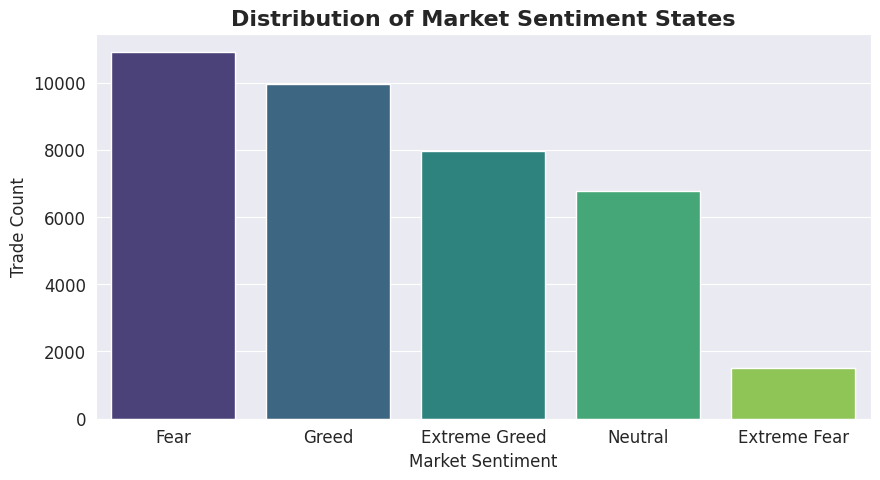
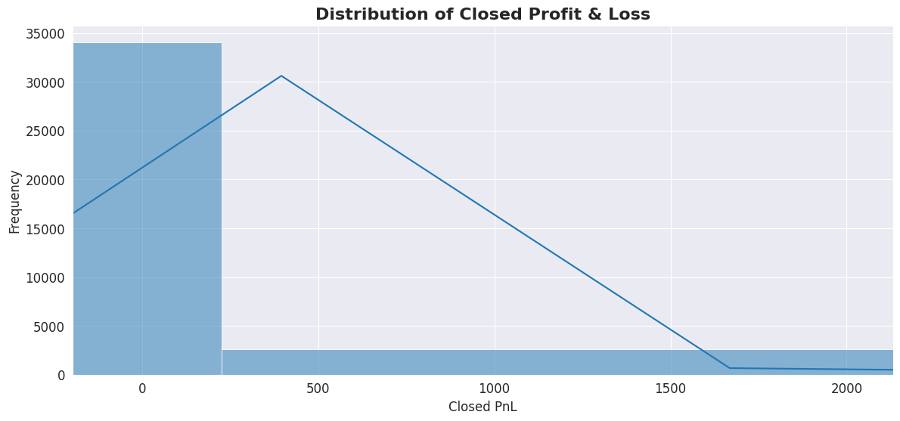
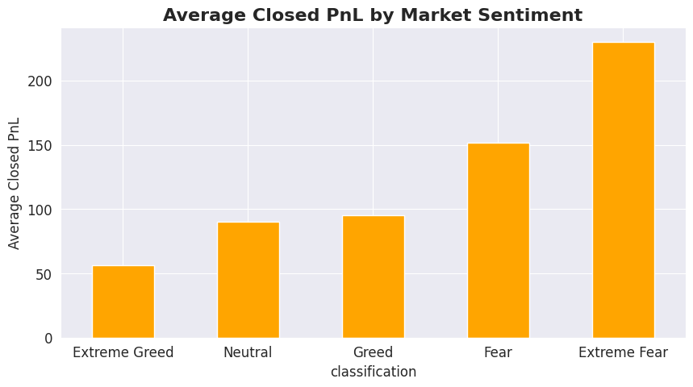
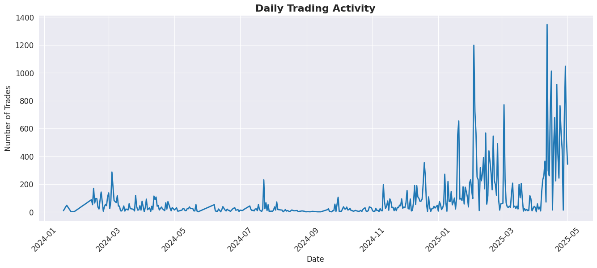
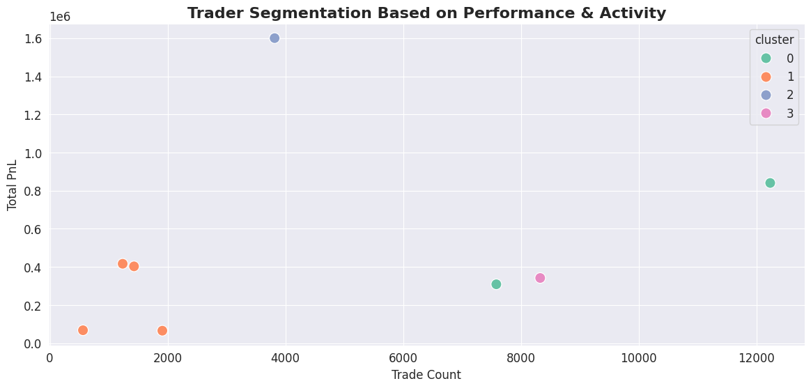
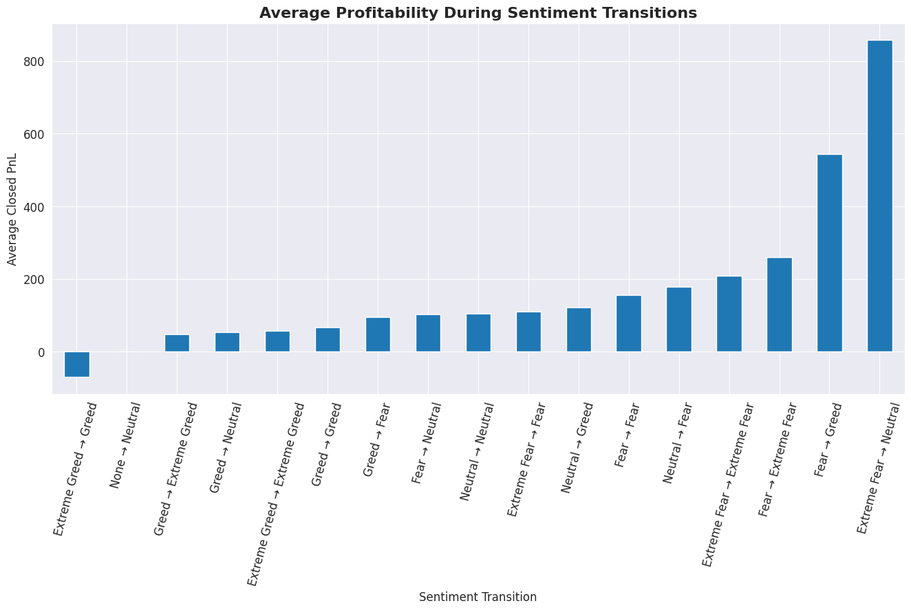

<div align="center">


<br>


<br><br>

<h3>
Behavioral Finance • Quantitative Analysis • Trader Intelligence • Market Psychology
</h3>

<p>
An advanced behavioral analytics project exploring how crypto market sentiment influences trader profitability, execution patterns, activity intensity, and risk behavior using real Hyperliquid trading data and the Bitcoin Fear & Greed Index.
</p>

</div>

---

# Project Overview

Most trading analyses focus only on prices.

This project focuses on the people behind those trades.

The objective of this analysis was to understand how emotional market conditions such as:

* Fear
* Extreme Fear
* Greed
* Extreme Greed

influence:

* trader profitability
* risk appetite
* trading consistency
* behavioral volatility
* execution quality
* market participation

Using historical trading activity from Hyperliquid combined with the Bitcoin Fear & Greed Index, this project uncovers hidden behavioral patterns across different emotional market cycles.

---

# Key Questions Explored

* Do traders perform better during Fear or Greed conditions?
* Does emotional market behavior affect trading consistency?
* How does trader activity evolve during volatile market periods?
* Can trader groups be segmented based on behavioral patterns?
* Are sentiment transitions associated with profitability instability?
* Does aggressive participation actually improve performance?

---

# Repository Structure

```bash
crypto-trader-sentiment-analysis/
│
├── data/
│   ├── historical_data.csv
│   └── fear_greed_index.csv
│
├── notebook/
│   └── trader_sentiment_analysis.ipynb
│
├── report/
│   └── final_report.pdf
│
├── visuals/
│   ├── sentiment_distribution.png
│   ├── pnl_distribution.png
│   ├── avg_pnl_sentiment.png
│   ├── daily_trading_activity.png
│   ├── trader_clusters.png
│   └── sentiment_transition.png
│
├── README.md
├── requirements.txt
└── LICENSE
```

---

# Visual Highlights

## Market Sentiment Distribution

<div align="center">

</div>

<br>

## Profitability Distribution

<div align="center">

</div>

<br>

## Average Profitability Across Sentiment States

<div align="center">

</div>

<br>

## Daily Trading Activity Trend

<div align="center">

</div>

<br>

## Trader Segmentation Analysis

<div align="center">

</div>

<br>

## Sentiment Transition Profitability

<div align="center">

</div>

---

# Major Findings

## Fear-driven markets generated surprisingly strong profitability

One of the most interesting findings throughout the analysis was that Extreme Fear conditions produced some of the highest average profitability outcomes.

This suggests that disciplined or contrarian trading behavior may outperform emotionally reactive participation during panic-driven environments.

---

## Trading activity accelerated sharply during emotionally volatile periods

The analysis revealed substantial spikes in trader participation during late 2024 and early 2025.

Periods of elevated emotional intensity were consistently associated with:

* higher trading activity
* increased pnl volatility
* unstable profitability outcomes
* aggressive speculative behavior

---

## A small percentage of traders dominated profitability

The trader profiling analysis showed that a relatively small group of participants generated disproportionately large profitability compared to the broader trading population.

This highlights the uneven distribution of execution quality and strategic discipline across traders.

---

## Market sentiment alone does not guarantee profitability

Although sentiment conditions influenced behavior significantly, profitability itself demonstrated weak direct linear correlation with raw sentiment scores.

This indicates that:

> execution quality, strategy discipline, and risk management mattered more than emotional market direction alone.

---

## Sentiment transitions created behavioral instability

One of the strongest observations emerged during sentiment transition analysis.

Abrupt emotional shifts such as:

* Fear → Greed
* Greed → Fear

often produced unstable pnl behavior and inconsistent trading performance.

This suggests that emotional market reversals may create elevated execution risk.

---

# Advanced Analysis Performed

This project goes significantly beyond basic exploratory analysis.

The notebook includes:

* Behavioral Finance Analysis
* Trader Profiling
* Sentiment-Aware Profitability Analysis
* Risk & Volatility Analysis
* Correlation Mapping
* Temporal Trading Activity Analysis
* Trader Segmentation using KMeans Clustering
* Sentiment Transition Modeling
* Profitability Trend Analysis
* Behavioral Feature Engineering

---

# Technologies Used

| Category         | Technologies                                 |
| ---------------- | -------------------------------------------- |
| Programming      | Python                                       |
| Data Processing  | Pandas, NumPy                                |
| Visualization    | Matplotlib, Seaborn                          |
| Machine Learning | Scikit-learn                                 |
| Reporting        | LaTeX                                        |
| Analysis Type    | Behavioral Analytics & Quantitative Analysis |

---

# How To Run This Project

## 1. Clone the repository

```bash
git clone https://github.com/your-username/crypto-trader-sentiment-analysis.git
```

---

## 2. Navigate into the project

```bash
cd crypto-trader-sentiment-analysis
```

---

## 3. Install dependencies

```bash
pip install -r requirements.txt
```

---

## 4. Launch Jupyter Notebook

```bash
jupyter notebook
```

---

## 5. Open the notebook

```bash
notebook/trader_sentiment_analysis.ipynb
```

---

# Project Deliverables

| Deliverable      | Description                                |
| ---------------- | ------------------------------------------ |
| Jupyter Notebook | Full end-to-end analytical workflow        |
| PDF Report       | Professionally formatted analytical report |
| Visualizations   | Behavioral and sentiment-driven insights   |
| README           | Comprehensive project overview             |

---

# Business & Strategic Relevance

This project demonstrates how behavioral analytics can be applied to real-world crypto trading environments.

Potential applications include:

* sentiment-aware trading systems
* trader risk profiling
* behavioral anomaly detection
* volatility-sensitive position sizing
* execution quality monitoring
* market psychology intelligence

---

# Future Improvements

Future enhancements may include:

* real-time sentiment integration
* predictive profitability modeling
* reinforcement learning strategies
* anomaly detection systems
* portfolio-level risk analytics
* live behavioral monitoring dashboards

---

# Report & Notebook Access

## Full Analytical Report

```bash
report/final_report.pdf
```

---

## Jupyter Notebook

```bash
notebook/trader_sentiment_analysis.ipynb
```

---

# License

This project is licensed under the MIT License.

```text
MIT License

Copyright (c) 2026 Bhavesh Gudlani

Permission is hereby granted, free of charge, to any person obtaining a copy
of this software and associated documentation files.
```

---

# Final Thoughts

Financial markets are not driven purely by numbers.

They are driven by:

* fear
* greed
* uncertainty
* conviction
* momentum
* human behavior

This project attempts to quantify a small part of that emotional complexity using data-driven behavioral analysis.

By combining market sentiment with real execution-level trading activity, the analysis highlights how trader psychology can materially influence profitability, participation, and market stability within highly volatile crypto ecosystems.

---

<div align="center">

<h3>
Built with curiosity, analysis, and a strong obsession for understanding behavioral market dynamics.
</h3>

<br>


</div>
